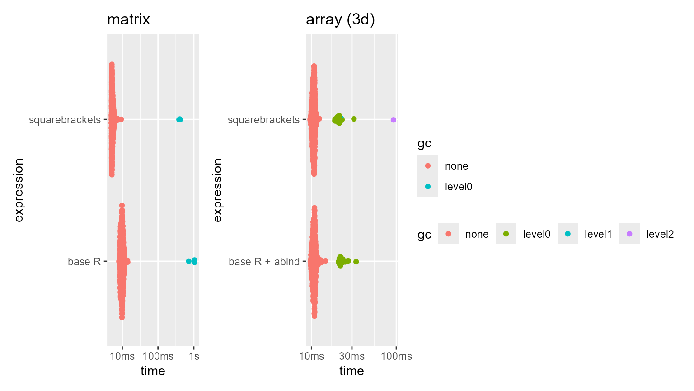
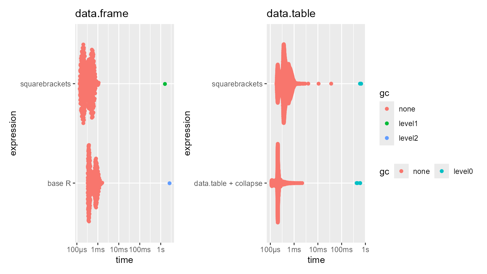

# Benchmarks - extract, exchange, duplicate

``` r
library(squarebrackets)
#> Run `?squarebrackets::squarebrackets_help` to open the introduction help page of 'squarebrackets'.
```

 

## Introduction

Due to the many checks and conversions performed by the
`squarebrackets::` functions, to make sub-setting more programmatically
and beginner friendly, the functions are almost necessarily slower than
base R’s `[`-like operators.

However, a considerable effort was made to keep the speed loss to a
minimum. Generally, the speed loss is indeed negligible, and in some
cases there is even speed improvement (thanks to the heavy lifting
performed by the ‘collapse’ package).

Below are some benchmarks to give one an idea of the speed loss. These
are just examples; speed is determined by a great number of factors.

 

``` r
library(bench)
library(ggplot2)
library(patchwork)
```

## Atomic objects

### Matrix

``` r

n <- 5e3
x.mat <- matrix(seq_len(n*n), ncol = n)
colnames(x.mat) <- sample(c(letters, NA), n, TRUE)
sel.rows <- 1:100
sel.cols <- rep(sample(letters[1:13]), 10)
bm.sb_x.matrix <- bench::mark(
  "squarebrackets" = ss_x(x.mat, n(sel.rows, sel.cols)),
  "base R" = x.mat[sel.rows, lapply(sel.cols, \(i) which(colnames(x.mat) == i)) |> unlist(), drop = FALSE],
  min_iterations = 500
)
bm.sb_x.matrix
summary(bm.sb_x.matrix)
```

    #> # A tibble: 2 × 6
    #>   expression          min   median `itr/sec` mem_alloc `gc/sec`
    #>   <bch:expr>     <bch:tm> <bch:tm>     <dbl> <bch:byt>    <dbl>
    #> 1 squarebrackets   4.96ms   5.27ms      186.    9.71MB    1.12 
    #> 2 base R           8.13ms   9.83ms      101.    14.6MB    0.818

 

### Array (3D)

``` r
x.dims <- c(5000, 2000, 4)
x.3d <- array(1:prod(x.dims), x.dims)
sel.rows <- 1:900
sel.lyrs <- c(TRUE, FALSE, TRUE, FALSE)
bm.sb_x.3d <- bench::mark(
  "squarebrackets" =  ss_x(x.3d, n(sel.rows, sel.lyrs), c(1,3)),
  "base R + abind" = abind::asub(x.3d, idx = list(sel.rows, sel.lyrs), dims = c(1,3)),
  min_iterations = 500
)
summary(bm.sb_x.3d)
```

    #> # A tibble: 2 × 6
    #>   expression          min   median `itr/sec` mem_alloc `gc/sec`
    #>   <bch:expr>     <bch:tm> <bch:tm>     <dbl> <bch:byt>    <dbl>
    #> 1 squarebrackets   9.64ms   10.6ms      94.1    13.7MB     7.52
    #> 2 base R + abind    9.7ms   10.7ms      92.8    13.7MB     6.56

 

### Plot



 

## Data.frame-like objects

### data.frame

``` r
n <- 1e5
ncol <- 200
chrmat <- matrix(
  sample(letters, n*ncol, replace = TRUE), ncol = ncol
)
intmat <- matrix(
  seq.int(n*ncol), ncol = ncol
)
x <- cbind(chrmat, intmat) |> as.data.frame()
rm(list = c("chrmat", "intmat"))
colnames(x) <- make.names(colnames(x), unique = TRUE)
sel.cols <- rep(sample(names(x), 10), 4)
sel.rows <- 1:1000
bm.sb_x.df <- bench::mark(
  "squarebrackets" = tt_x(x, sel.rows,  sel.cols),
  "base R" = x[sel.rows, sel.cols, drop = FALSE],
  min_iterations = 500
)
summary(bm.sb_x.df)
```

    #> # A tibble: 2 × 6
    #>   expression          min   median `itr/sec` mem_alloc `gc/sec`
    #>   <bch:expr>     <bch:tm> <bch:tm>     <dbl> <bch:byt>    <dbl>
    #> 1 squarebrackets    124µs    181µs     4812.     318KB        0
    #> 2 base R            389µs    482µs     1790.     372KB        0

 

### data.table

``` r
x <- data.tableas.data.table(x)
tempfun <- function(x, i, j) {
  x <- collapse::ss(x, i, j, check = TRUE)
  names(x) <- make.names(names(x), unique = TRUE)
  return(x)
}
bm.sb_x.dt <- bench::mark(
  "squarebrackets" = tt_x(x, obs = sel.rows, vars = sel.cols),
  "data.table + collapse" = tempfun(x, sel.rows, sel.cols),
  min_iterations = 1e4
)
summary(bm.sb_x.dt)
```

    #> # A tibble: 2 × 6
    #>   expression                 min   median `itr/sec` mem_alloc `gc/sec`
    #>   <bch:expr>            <bch:tm> <bch:tm>     <dbl> <bch:byt>    <dbl>
    #> 1 squarebrackets           185µs    321µs     3111.     342KB        0
    #> 2 data.table + collapse    181µs    249µs     3036.     341KB        0

 

### plot



 

## Long vectors

``` r
x <- sample(1:10, 1e7, TRUE)
ptrn <- c(TRUE, FALSE, FALSE, TRUE)

bm.long_x <- bench::mark(
  "value in squarebrackets" = long_x(x, stride_v(x, v = 5)),
  "value in base R" = x[x == 5],
  "seq in squarebrackets" = long_x(x, ~ 1:(.N - 10):2:1),
  "seq in base R" = x[seq(1, length(x) - 10, 2)],
  "ptrn in squarebrackets" = long_x(x, ~ 1:(.N - 10):ptrn:1),
  "ptrn in base R" = x[ (1:(length(x) - 10))[ptrn] ],
  check = FALSE,
  min_iterations = 100
)
summary(bm.long_x)
```

    #> # A tibble: 6 × 6
    #>   expression                   min   median `itr/sec` mem_alloc `gc/sec`
    #>   <bch:expr>              <bch:tm> <bch:tm>     <dbl> <bch:byt>    <dbl>
    #> 1 value in squarebrackets   6.58ms    7.2ms     137.        1MB     4.24
    #> 2 value in base R           6.59ms   7.36ms     135.    16.79MB    89.8 
    #> 3 seq in squarebrackets    870.6µs  967.4µs     967.      3.9MB    74.6 
    #> 4 seq in base R             9.99ms  11.13ms      90.4    26.7MB   108.  
    #> 5 ptrn in squarebrackets   995.3µs   1.11ms     860.     3.92MB    61.5 
    #> 6 ptrn in base R            4.56ms   4.88ms     203.    11.44MB    50.8

Notice that the `long_x` method from ‘squarebrackets’ uses approximately
4 to 20 times (!) less memory than the equivalent base ‘R’ approaches,
and is also 2 to 4 times faster.
