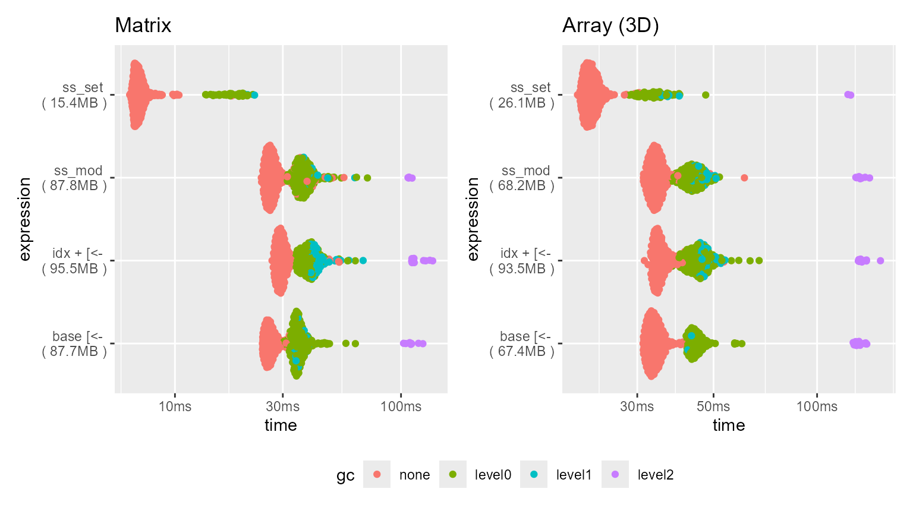
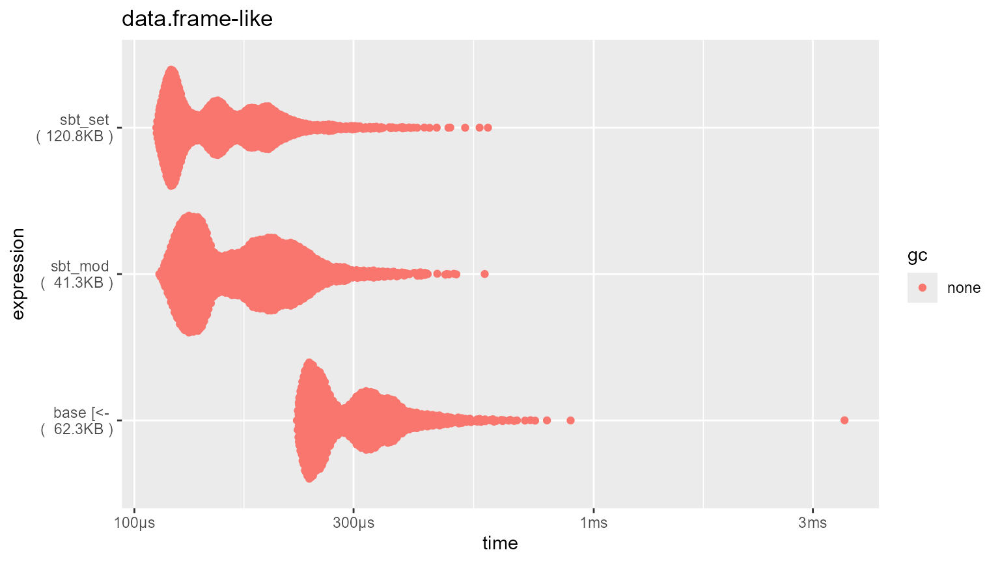

# Benchmarks - transform operations

``` r
library(squarebrackets)
#> Run `?squarebrackets::squarebrackets_help` to open the introduction help page of 'squarebrackets'.
```

 

## Introduction

Base R’s `[<-`, `[[<-`, `$<-` methods perform in-place modification on
subsets of objects using “copy-on-modify” semantics. The
‘squarebrackets’ R-package provides 2 alternative semantics for
modification: “pass-by-reference” through the `*_set` methods, and
“pass-by-value” through the `*_mod` methods. Moreover, where base ‘R’
provides direct replacement only, ‘squarebrackets’ provides both
replacement (through the `rp` argument) and transformation (through the
`tf` argument) mechanics. Thus, ‘squarebrackets’ and base R are not
really directly comparable in terms of benchmarking. Nonetheless, I have
tried to keep the comparisons somewhat fair.

The `*_set` methods are generally several times (2 to 5 times) faster
than base R’s in-place modification, and generally uses about half the
memory. The `*_mod` methods are generally about as fast as base R’s
in-place modification, and uses about the same amount of memory.

Below are some benchmarks to give one an idea of the speed loss. These
are just examples; speed is determined by a great number of factors. To
keep comparisons between the classes fair, all objects have
approximately `1e7` elements.

 

``` r
library(bench)
library(ggplot2)
library(patchwork)
library(tinycodet)
#> Run `?tinycodet::tinycodet` to open the introduction help page of 'tinycodet'.
```

``` r

plotfun <- function(title1, bm1, title2, bm2) {

  plotdat1 <- bm1 |> tidyr::unnest(cols = c("time", "gc", "mem_alloc"))
  plotdat1$expression <- paste(
    plotdat1$expression,
    "\n (", as.character(plotdat1$mem_alloc), ")"
  )
  p1 <- ggplot(plotdat1, aes_pro(x = ~ time, y = ~ expression, color = ~ gc)) +
  ggbeeswarm::geom_quasirandom() + ggtitle(title1)

  plotdat2 <- bm2 |> tidyr::unnest(cols = c("time", "gc", "mem_alloc"))
  plotdat2$expression <- paste(
    plotdat2$expression,
    "\n (", as.character(plotdat2$mem_alloc), ")"
  )
  p2 <- ggplot(plotdat2, aes_pro(x = ~ time, y = ~ expression, color = ~ gc)) +
  ggbeeswarm::geom_quasirandom() + ggtitle(title2)

  combined <- p1 + p2 & theme(legend.position = "bottom")
  combined + plot_layout(guides = "collect")
}
```

## Atomic objects

### Matrix

``` r

n <- 3162 # approx sqrt(1e7)
x.mat <- matrix(seq_len(n*n), ncol = n)
x.mat2 <- as.mutable_atomic(x.mat)
colnames(x.mat) <- sample(c(letters, LETTERS, NA), n, TRUE)
sel.rows <- 1:1000
sel.cols <- 1:1000
basefun <- function(x, rows, cols, tf) {
  x[rows, cols] <- tf(x[rows, cols])
  return(x)
}
base_plus_idx <- function(x, rows, cols, tf) {
  x[idx(x, n(rows, cols), 1:2)] <- tf(x[idx(x, n(rows, cols), 1:2)])
  return(x)
}
tf <- function(x) { return(-1 * x) }
bm.sb_tf.matrix <- bench::mark(
  "base [<-" =  basefun(x.mat, sel.rows, sel.cols, tf = tf),
  "idx + [<-" = base_plus_idx(x.mat, sel.rows, sel.cols, tf = tf),
  "ss_set" = ss_set(x.mat2, n(sel.rows, sel.cols), tf = tf),
  "ss_mod" = ss_mod(x.mat, n(sel.rows, sel.cols), tf = tf),
  check = FALSE,
  min_iterations = 500
)
bm.sb_tf.matrix
summary(bm.sb_tf.matrix)
```

    #> # A tibble: 4 × 6
    #>   expression      min   median `itr/sec` mem_alloc `gc/sec`
    #>   <bch:expr> <bch:tm> <bch:tm>     <dbl> <bch:byt>    <dbl>
    #> 1 base [<-    24.37ms  26.07ms      37.6    87.7MB     51.1
    #> 2 idx + [<-   26.88ms  29.35ms      33.4    95.5MB     32.6
    #> 3 ss_set       6.31ms   6.87ms     142.     15.4MB     11.7
    #> 4 ss_mod       24.1ms  26.51ms      36.7    87.8MB     30.8

 

### Array (3D)

``` r

x.dims <- c(1900, 1900, 3) # leads to approx 1e7 elements
x.3d <- array(1:prod(x.dims), x.dims)
x.3d2 <- as.mutable_atomic(x.3d)
sel.rows <- 1:900
sel.lyrs <- c(TRUE, FALSE, TRUE)
basefun <- function(x, rows, lyrs, tf) {
  x[rows, , lyrs] <- tf(x[rows, , lyrs])
  return(x)
}
base_plus_idx <- function(x, rows, lyrs, tf) {
  x[idx(x, n(rows, lyrs), c(1, 3))] <- tf(x[idx(x, n(rows, lyrs), c(1, 3))])
  return(x)
}
tf <- function(x) { return(-1 * x) }
bm.sb_tf.3d <- bench::mark(
  "base [<-" = basefun(x.3d, sel.rows, sel.lyrs, tf = tf ),
  "idx + [<-" = base_plus_idx(x.3d, sel.rows, sel.lyrs, tf = tf),
  "ss_set" =  ss_set(x.3d2, n(sel.rows, sel.lyrs), c(1,3), tf = tf),
  "ss_mod" = ss_mod(x.3d, n(sel.rows, sel.lyrs), c(1, 3), tf = tf),
  check = FALSE,
  min_iterations = 500
)
summary(bm.sb_tf.3d)
```

    #> # A tibble: 4 × 6
    #>   expression      min   median `itr/sec` mem_alloc `gc/sec`
    #>   <bch:expr> <bch:tm> <bch:tm>     <dbl> <bch:byt>    <dbl>
    #> 1 base [<-     31.2ms   33.3ms      29.7    67.4MB    14.8 
    #> 2 idx + [<-    31.5ms   34.4ms      28.6    93.5MB    27.5 
    #> 3 ss_set       20.1ms   21.9ms      45.2    26.1MB     7.36
    #> 4 ss_mod       31.3ms   33.9ms      29.3    68.2MB    18.9

 

### Plot

    #> Orientation inferred to be along y-axis; override with
    #> `position_quasirandom(orientation = 'x')`
    #> Orientation inferred to be along y-axis; override with
    #> `position_quasirandom(orientation = 'x')`



 

## Data.frame-like

``` r
n <- 1e5
ncol <- 200 # times 2
chrmat <- matrix(
  sample(letters, n*ncol, replace = TRUE), ncol = ncol
)
intmat <- matrix(
  seq.int(n*ncol), ncol = ncol
)
df <- cbind(chrmat, intmat) |> as.data.frame()
colnames(df) <- make.names(colnames(df), unique = TRUE)
dt <- data.table::as.data.table(df)
rm(list = c("chrmat", "intmat"))

sel.rows <- 1:1000
basefun <- function(x, rows, tf) {
  x[rows, sapply(x, is.numeric)] <- lapply(x[rows, sapply(x, is.numeric)], tf)
  return(x)
}
gc()
bm.sb_tf.df <- bench::mark(
  "base [<-" = basefun(df, sel.rows, tf = \(x) -1 * x),
  "tt_set" = tt_set(
    dt, row = sel.rows, vars = is.numeric, tf = \(x) -1 * x
  ),
  "tt_mod" = tt_mod(
    df, row = sel.rows, vars = is.numeric, tf = \(x) -1 * x
  ),
  check = FALSE,
  min_iterations = 500
)
```

    #> # A tibble: 3 × 6
    #>   expression      min   median `itr/sec` mem_alloc `gc/sec`
    #>   <bch:expr> <bch:tm> <bch:tm>     <dbl> <bch:byt>    <dbl>
    #> 1 base [<-      241µs    519µs     1948.    77.1KB        0
    #> 2 tt_set        129µs    171µs     4181.      77KB        0
    #> 3 tt_mod        120µs    192µs     4412.    44.7KB        0

 

    #> Orientation inferred to be along y-axis; override with
    #> `position_quasirandom(orientation = 'x')`



 
